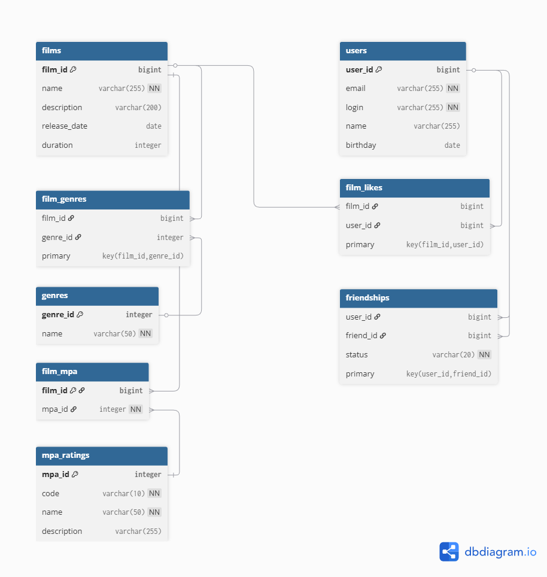

# java-filmorate
Template repository for Filmorate project.  
Приложение для оценки фильмов


## Схема базы данных


## Описание таблиц


- **users** - таблица пользователей
- **films** - таблица фильмов (основная информация)
- **mpa_ratings** - справочник рейтингов MPA
- **genres** - справочник жанров
- **film_mpa** - связь фильмов с рейтингами MPA (один-к-одному)
- **film_genres** - связь фильмов с жанрами (многие-ко-многим)
- **film_likes** - лайки фильмов от пользователей
- **friendships** - дружеские связи между пользователями

## Примеры SQL запросов

### Получение топ-10 популярных фильмов с MPA-рейтингом и жанрами
```sql
SELECT 
    f.film_id,
    f.name,
    f.description,
    f.release_date,
    f.duration,
    m.code as mpa_code,
    m.name as mpa_name,
    COUNT(fl.user_id) as likes_count,
    GROUP_CONCAT(DISTINCT g.name) as genres
FROM films f
LEFT JOIN film_likes fl ON f.film_id = fl.film_id
LEFT JOIN film_mpa fm ON f.film_id = fm.film_id
LEFT JOIN mpa_ratings m ON fm.mpa_id = m.mpa_id
LEFT JOIN film_genres fg ON f.film_id = fg.film_id
LEFT JOIN genres g ON fg.genre_id = g.genre_id
GROUP BY 
    f.film_id, 
    f.name, 
    f.description, 
    f.release_date, 
    f.duration,
    m.code,
    m.name
ORDER BY likes_count DESC
LIMIT 10;
```

### Получение общих друзей двух пользователей
```sql
SELECT u.* 
FROM users u
JOIN friendships f1 ON u.user_id = f1.friend_id AND f1.user_id = ? AND f1.status = 'CONFIRMED'
JOIN friendships f2 ON u.user_id = f2.friend_id AND f2.user_id = ? AND f2.status = 'CONFIRMED';
```